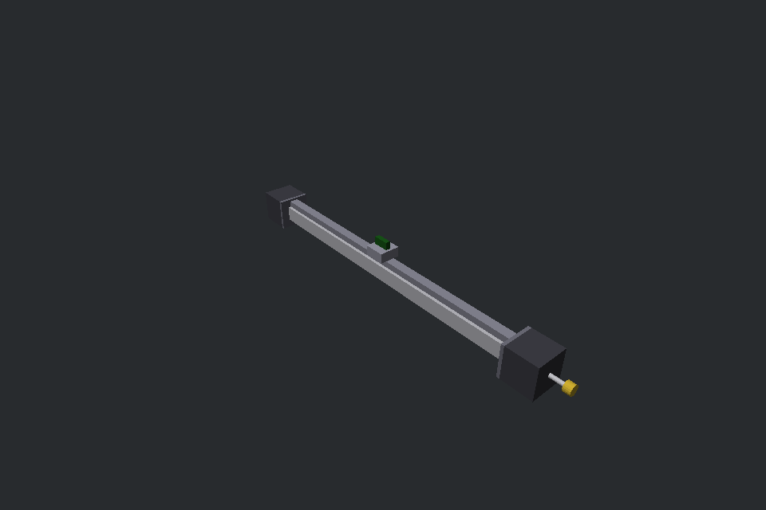
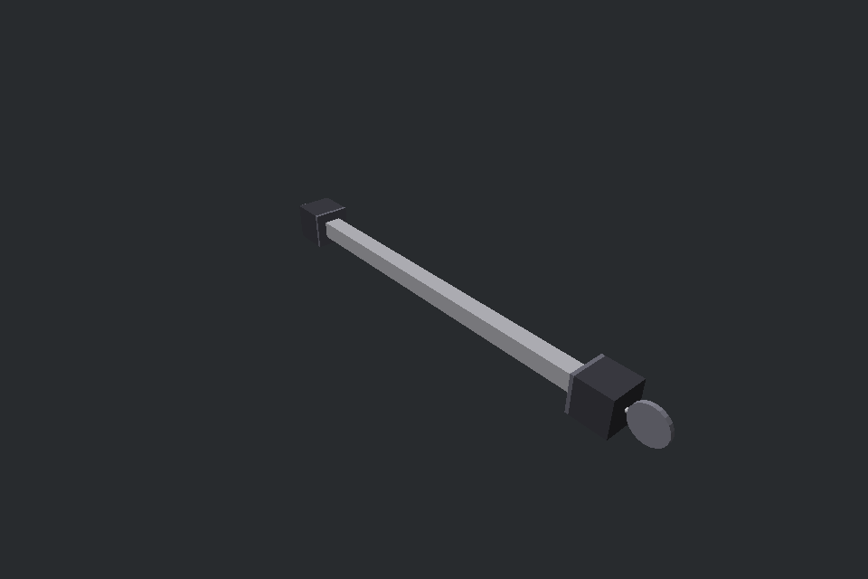
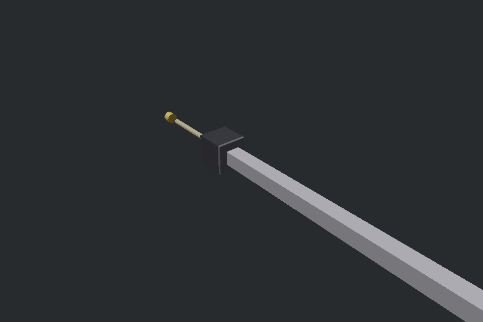
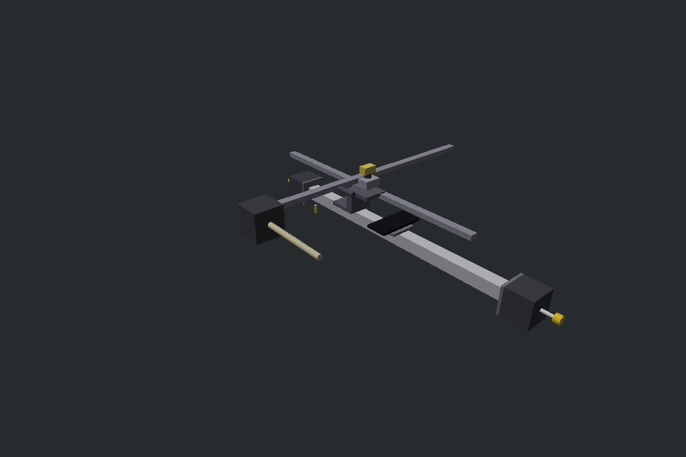
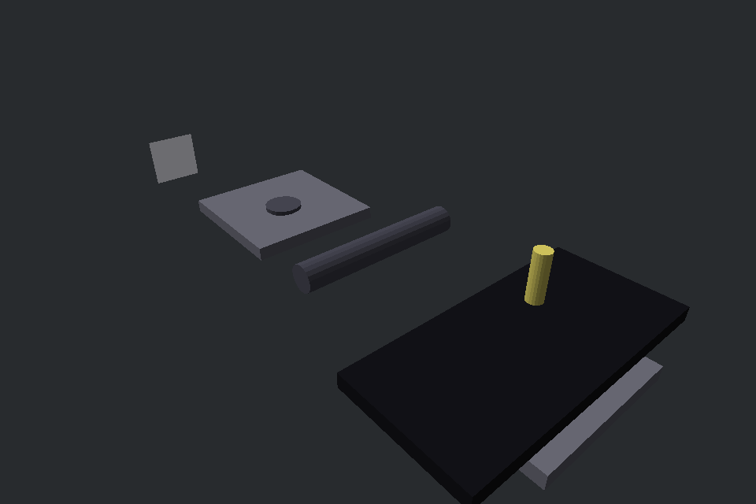

# MechMaker — Architecture & Verified Behaviour

> Every number in this document is asserted by a test. Run `dotnet test` (195 tests).

One artifact — `machine.json` — drives three frontends: the visual builder (M3),
the MCP server for LLM agents (M4), and the headless engine everything shares.

```
catalog (parts) ──►  machine.json  ◄── visual builder (Avalonia, M3)
                     - parts + poses        ──► MuJoCo physics (8 kHz) + virtual MCU
                     - connections          ──► MCP server, 43 tools for LLM agents (M4)
                     - wiring (netlist)     ──► Klipper wire protocol (M5) · HIL emulator (M6)
```

## The engine (M1/M2)

- MuJoCo 3.11 through Evergine.Bindings, **8 kHz fixed timestep, bitwise
  deterministic** (repeated runs assert equal state vectors).
- One virtual-MCU stepper channel per wired motor: commanded phase advances in
  microsteps; magnetic torque `T_hold · sin(electrical error)` pulls the rotor —
  so overloading the motor misses steps exactly like hardware.

Verified on the example belt axis (`examples/linear_axis_v0.json`, GT2-20T):

| Claim | Test-verified value |
|---|---|
| Ramp-following | 40 rev/s² ramp to 1 rev/s, **0.22 steps of lag**, zero missed steps |
| Kinematics | carriage travels **40 mm per pulley revolution** |
| Homing | endstop fires at the 20 mm trigger, debounced |
| Stall physics | 20 rev/s without ramp → stall with counted missed steps |
| Determinism | repeated runs bitwise identical |



*The example axis: 2020 beam, MGN12 rail, belt-driven carriage, NEMA 17s with GT2
pulleys at the ends (yellow), endstop (green).*

## Couplers (M5 catalog)

Three kinematic couplings, each closed-loop tested:

| Coupling | Parts | Verified behaviour |
|---|---|---|
| Belt | pulleys + belt + clamp | 40 mm/rev carriage, stall detection, back-driving a de-energised slave is *not* a fault |
| Leadscrew | T8-8 screw + nut | **8 mm of nut travel per revolution** |
| Gear mesh | 20T/40T spur gears | half-speed ratio across the mesh |




*Left: the 20T:40T gear train (mesh is a hinge-to-hinge ratio coupler). Right: the
leadscrew Z axis — one revolution of the screw advances the brass nut 8 mm.*

## Servos, fans, heat

- Servos are position actuators (hinge: degrees; slide: metres —
  `min_pos_m`/`max_pos_m`), damped ζ≈1 so commands converge in ~100 ms.
- DC components (40 mm fan) track duty × rated rpm.
- The hotend is the engine's first non-mechanical state: a lumped thermal model
  (25 W vs Newton cooling, τ ≈ 43 s — real hotends heat slowly too), integrated
  at the physics timestep, deterministic like everything else.

## Klipper MCU protocol (M5)

The virtual MCU speaks the real wire format — VLQ integers (ported byte-for-byte
from `klippy/msgproto.py`), CRC16-CCITT blocks, ack/nak sequencing, zlib data
dictionary over `identify`. The host role is klipper-shaped commands:

`allocate_oids` → `config_stepper`/`config_endstop` → `finalize_config` →
`reset_step_clock` → `set_next_step_dir` → `queue_step` → `stepper_get_position`,
plus `endstop_home` (move-queue halting on trigger) and `config_pwm_out`/
`set_pwm_out` for servos and fans.

Verified over the wire: queue_step drives the same closed loop as the velocity
path (40 mm/rev again), `endstop_home` halts the queued move at the 20 mm trigger,
out-of-order blocks are nakked and retransmits accepted.

## HIL seam — Android emulator + OpenCV (M6)

The machine's `android_phone` part pairs with an emulator:

- **fake transport** — renders synthetic launcher screens, records taps; tests run
  real OpenCV template matching with no adb;
- **live adb** — verified end-to-end against a real Android 16 emulator
  (`tools/hil_live.ps1`).

The flagship scenario, `tools/scenario_smoke_wake_unlock.ps1`: wake → swipe to
unlock → home assertion by template → tap where vision pointed. All on live
Android, entirely through MCP tools.


*The emulator under test (Android 16, API 36): the HIL seam drives this UI with
physics taps and reads it with OpenCV.*

## The gantry and `tap_at` — the full loop

`examples/phone_gantry_rig.json` mounts a `touch_finger` on a belt-driven
carriage above the phone. The finger is androidtester's spring finger as a
servo-driven plunger (press −8 mm, retract +2 mm; hold for long-press timing).

**`tap_at(fx)` closes vision → motion → contact**: it measures the live scene
(arm offset, glass plane, press depth — no catalog constants), positions the
gantry with a correct-and-retry loop (converging within ~0.6 mm of a 68 mm
screen), presses 2 mm past the glass, and reports the fraction the tip *actually
pressed* (the gantry parks where the physics puts it). Two commanded columns land
in their commanded neighbourhoods: 35% and 65%.



*The gantry rig: the phone (dark slab) sits on a side plate under the belt-driven
carriage; the finger tool hangs from the carriage, arming over the screen.*



*The minimal rig: finger arming over the phone, side by side.*

### The Y axis: a real rig-design lesson

A two-axis attempt (a T8 leadscrew stage stacked on the X carriage, the finger
hanging from its nut) taught a mechanism lesson the hard way. The build revealed
three things, each caught by the closed loop:

1. **Mount frames compound** — every connector mating composes a rotation; the
   finger's orientation is the product of the whole chain from the root part.
   Hand-deriving the adapter euler fails; the honest approach is measuring body
   quaternions from the compiled model (`GetBodyQuaternion`) and solving for the
   adapter — implemented in the Simulator for exactly this.
2. **A leadscrew nut spins with its screw.** The Y stage's nut (and the finger
   hanging from it) is free to yaw around the screw axis — under the gantry's
   X-acceleration the whole arm swings ±27 mm and jams the belt (400+ missed
   steps). A real rig constrains the nut with a second rail or keyway.
3. **The press axis sign is mating-dependent** — the plunger's slide axis in
   world flips with the mount; a positioning controller must measure the axis
   direction and not assume a sign.

The 2-axis stage is therefore parked until the catalog grows a guided-carriage
pair (or a keyway/anti-rotation connector) — the physics is already honest about
why the naive rig fails, which is exactly what a digital twin is for.

## Lessons the tests forced us to learn (so you don't have to)

1. **8 kHz, not 1 kHz**: the stepper's magnetic spring is stiff; coarser
   zero-order-hold updates make it explode. The whole machine runs at the physics
   rate.
2. **The floor is visual-only**: assemblies are bolted to their own structure; a
   colliding ground plane shreds any shaft sitting at z=0.
3. **Energising every stepper of a belt loop makes them fight**: channels start
   de-energised; the host drives one motor and the belt back-drives the released
   slave (back-driving is not a fault — no missed steps).
4. **A position servo must be stiff enough to hold its payload**: kp=2 sagged
   20 mm (the plunger never left the glass); kp=80 sags 0.02 mm.
5. **MuJoCo cylinders take radius + FULL half-length** (the compiler halves the
   Y extent) and their axis is local **Z** — a "vertical plunger" authored with
   `rot [90,0,0]` maps Z→−Y and lies on its side.
6. **`adb exec-out` corrupts binary on Windows** (CRLF translation): screencap
   goes device-file → `adb pull` → temp file, byte-exact.
7. **Solid-colour templates have zero variance** — normalized cross-correlation
   degenerates; test icons carry internal structure.
8. **Simulator body positions are zero until kinematics run** — anything reading
   the compiled pose must refresh first.
